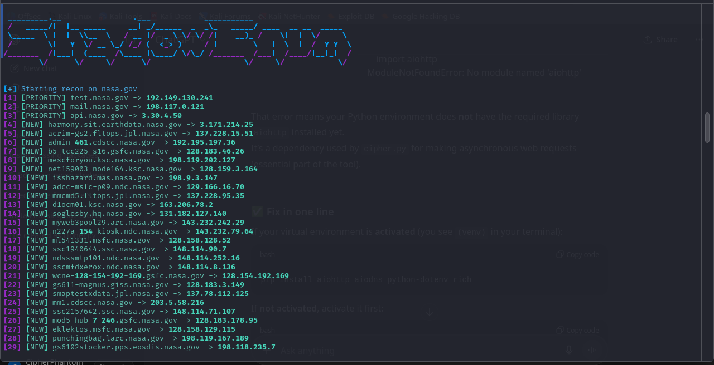

# cipher

**cipher** is an asynchronous passive reconnaissance tool in Python for subdomain enumeration.  
It aggregates passive sources (crt.sh, CertSpotter, BufferOver, RapidDNS, Wayback, Google) and optionally uses API-backed sources (VirusTotal, SecurityTrails, Shodan, AlienVault OTX). The tool performs DNS validation, wildcard detection, candidate permutation, and optional HTTP probing (status + title).

> ⚠️ **Security:** This repo does **not** include any hard-coded API keys. API keys are loaded from environment variables or a local `.env` file. **Do not** commit `.env` to version control.

---

# Quick single-file setup & usage

## 1. Clone
```bash
git clone https://github.com/fawadqureshi007/cipher.git
cd cipher

Create & activate Python virtual environment

Linux / macOS:
python3 -m venv venv
source venv/bin/activate

Then install
pip install --upgrade pip
pip install -r requirements.txt

Then Install this
pip install aiohttp aiodns python-dotenv rich

(Optional) Provide API keys

If you want to enable API-backed sources, create a .env file in the project root (do not commit it). You can copy the example below into .env and fill values:

.env.example (copy into .env and fill)

ST_API=
SHODAN_API=
OTX_API=
VT_API=
CERTSPOTTER_API=


Load keys (if using .env, the script loads it automatically if python-dotenv is installed) or export in shell:
export VT_API="your_virustotal_key"
# repeat for other keys as needed



5. Run

Basic:
python cipher.py example.com

With HTTB Probing:
python cipher.py example.com --http-probe

